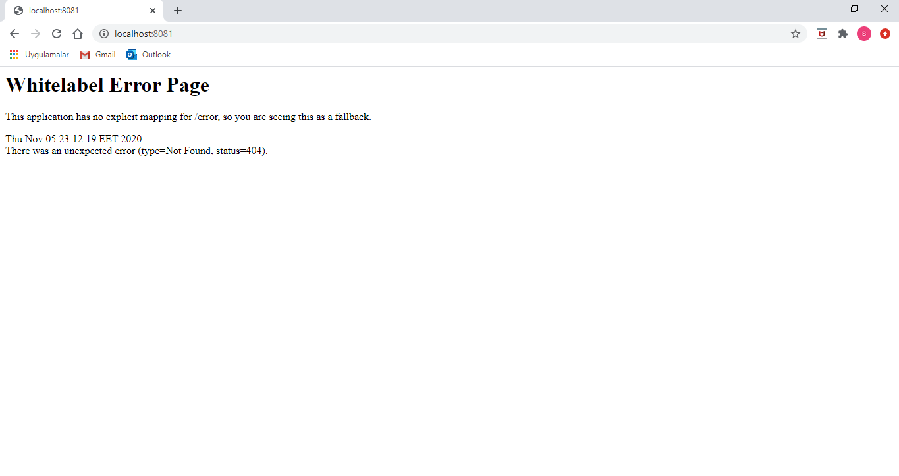
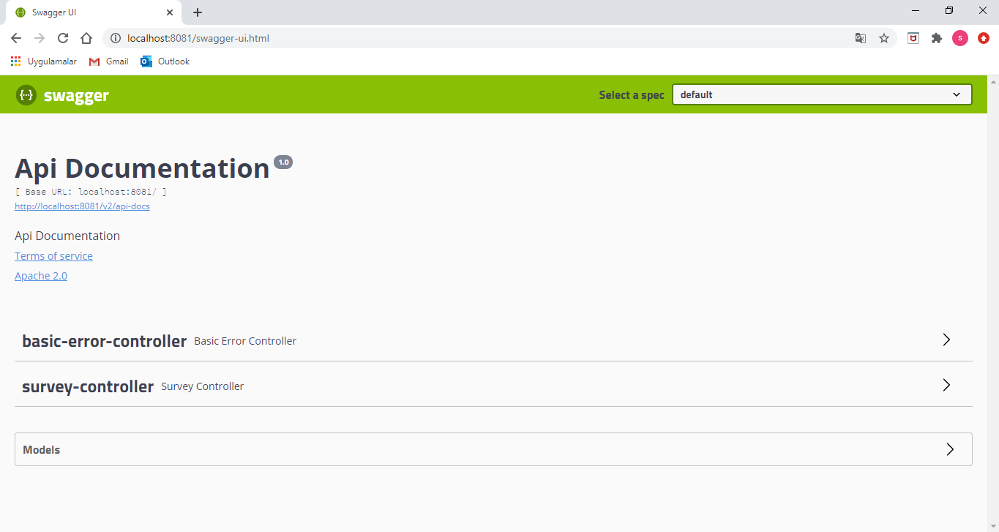
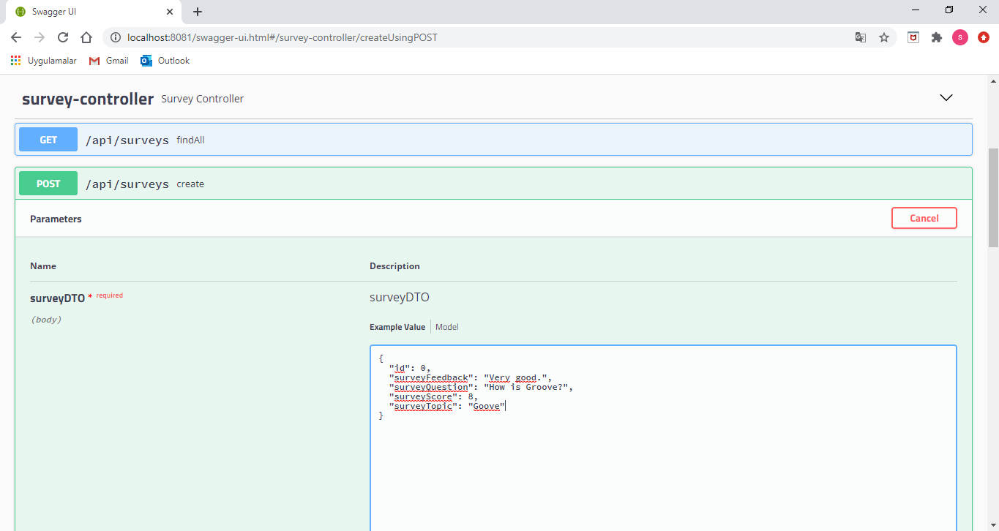
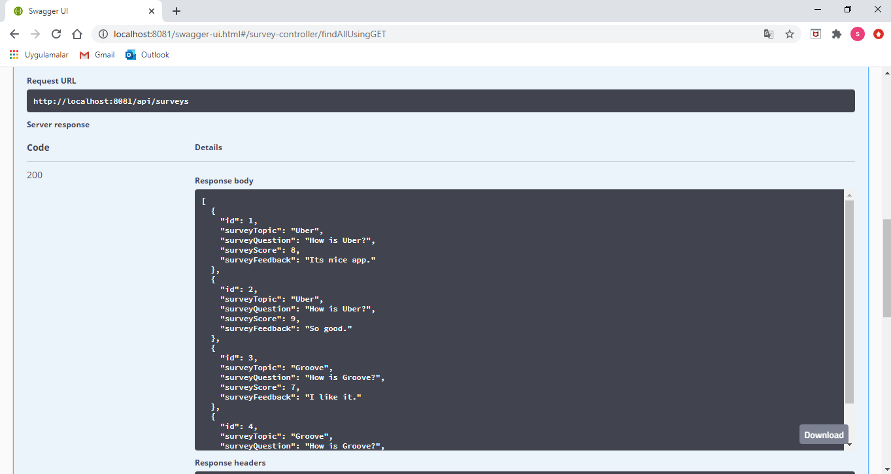
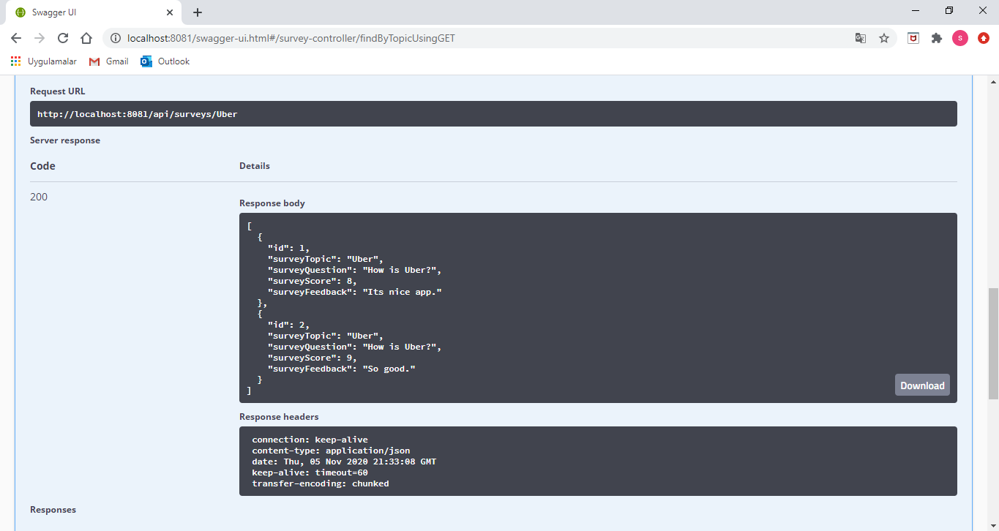
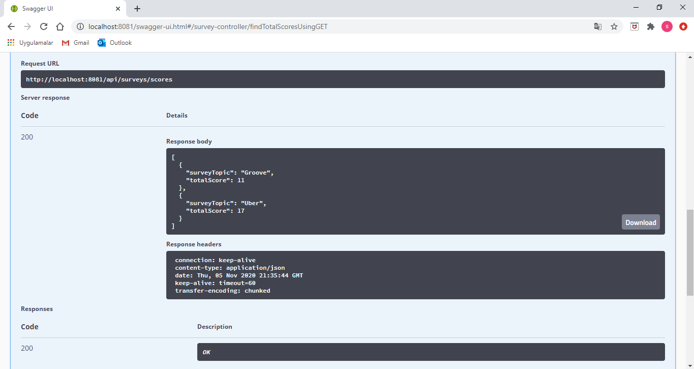
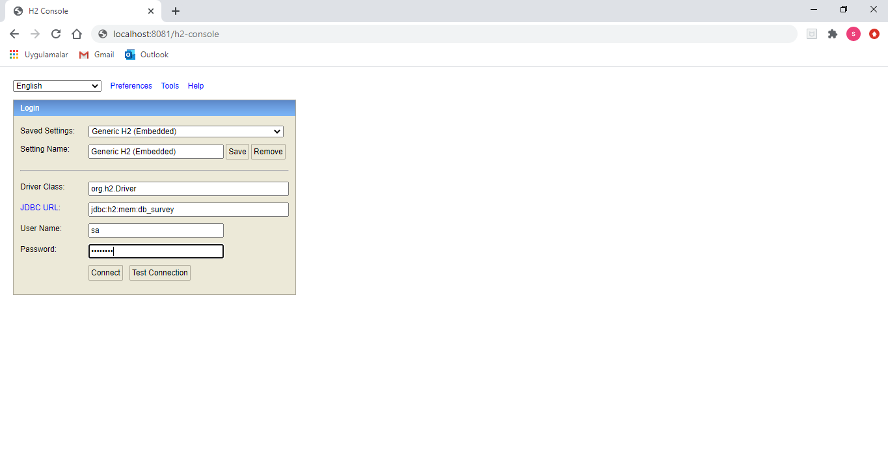
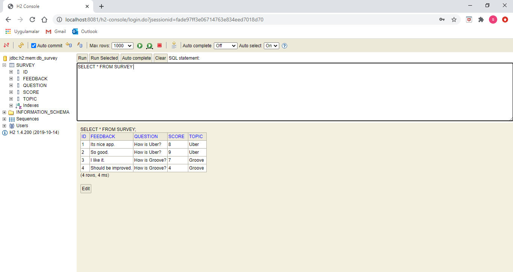

This application is prepared for the "Aegon Company" job task. 

 

How to run the project? 

This project is the customer satisfaction survey. 

 

On a separate terminal, perform the command in the root of the project: 

mvn clean install 

or 

mvnw clean install  (if you don't have installed maven on your OS) 

This will run the tests and create the jar file. 

 

After having the jar file, you can simply run: 

java -jar target/surveyapp-0.0.1-SNAPSHOT.jar 

 

You can also run the project with below command; 

mvn spring-boot:run 

or 

mvnw spring-boot:run (if you don't have installed maven on your OS) 

 

You can reach the index page by typing; 

http://localhost:8081/ 

The project will run on port 8081 (configured into application.properties). 

 

 

 

How to test the project? 

You can test the project with Swagger. 

To access the Swagger UI, just go to; 

http://localhost:8081/swagger-ui.html 

  

 

You can create survey; 

  

 

Find all surveys; 

  

 

Find survey by topic; 

  

 

Find total scores by topic; 

  

 

 

How to connect to database? 

This project is using H2 Database to store data. 

To access the H2 Database, just go to; 

http://localhost:8081/h2-console 

(JDBC URL : jdbc:h2:mem:db_survey) 

(User Name : sa) 

(Password : password) 

  

 

You can check the database from here: 

  

 
